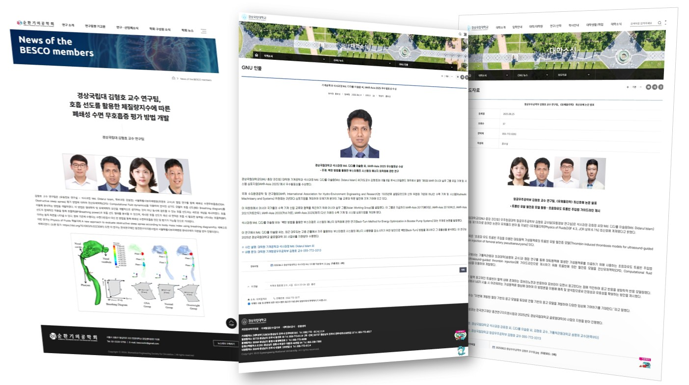

# 👋 Hi, I am Md. Didarul Islam  
> PhD Student, Department of Mechanical & Aerospace Engineering, GNU, South Korea || Senior Lecturer, Department of Mechanical Engineering (On Study Leave), IUBAT, Bangladesh

  

## 👨‍💻 About Me  

I’m passionate about uncovering the **physics of fluid flows in biological and engineering systems** through the combined power of **Computational Fluid Dynamics (CFD)** and hands-on experiments. Moreover, I am deeply motivated to explore the emerging fields of **Digital Twin and Medical Twin** technologies, utilizing my knowledge in fluid dynamics to connect simulation, AI, and Data-Driven methods for real-world applications. 

My research explores:  
- ⚙️ **Turbomachinery** – hydraulic performance optimization, cavitation and erosion studies, pump design improvements 
- 🔬 **Biofluids** – thrombin-induced clot formation in pseudoaneurysms, flow obstruction in ureteral models, airflow in upper airways
- 🧵 **Composite Materials** – design, synthesis, and evaluation of natural fiber reinforced composites, eco-friendly polymers, and additive manufacturing for biomedical applications
---

## 🛠️ Skills & Tools  

- **Core Expertise**: Teaching · Mechanical Design · Process Optimization  
- **Simulation & Analysis**: ANSYS CFX · ICEM CFD · CAD Tools (NX, SolidWorks, AutoCAD)
- **Programming & Data**: Python · MATLAB · C · Jupyter  
- **Research & Writing**: LaTeX · Mendeley · Academic Publishing  
- **Other**: Git · Automation Tools  
---

## 📚 Publications  

**Turbomachinery**
- [Effects of cavitation and erosion on submersible drainage-A numerical study](https://doi.org/10.1063/5.0223126) [*Physics of Fluids*] [SCIE] [**Q1**] [IF-4.3]
- [Optimized impeller hydraulic performance of submersible drainage pumps-An experimental study](https://doi.org/10.1063/5.0243408) [*Physics of Fluids*] [SCIE] [**Q1**] [IF-4.3]
- [Cavitation and erosion effects on hydraulic performances of a submersible drainage pump](https://doi.org/10.1016/j.aej.2024.11.060) [*Alexandria Engineering Journal*] [SCIE] [**Q1**] [IF-6.8]
- [Numerical Simulation of Solid Liquid Two‐Phase Flow Analysis of Submersible Drainage Pumps](https://doi.org/10.1002/ird.3119) [*Irrigation and Drainage*] [SCIE] [**Q2**] [IF-1.7]
- [Back-turn Approach for Optimal Operation of Booster Pump Systems](https://doi.org/10.47176/jafm.18.9.3428) [*Journal of Applied Fluid Mechanics*] [SCIE] [**Q3**] [IF-1.3]

**Biofluids**
- [Evaluation of renovated double J stents using ureter models with and without stenosis](https://doi.org/10.1007/s00345-024-04920-7) [*World Journal of Urology*] [SCIE] [**Q1**] [IF-2.9]
- [A new approach to evaluate obstructive sleep apnea according to body mass index using breathing diagram](https://doi.org/10.1063/5.0223081) [*Physics of Fluids*] [SCIE] [**Q1**] [IF-4.3]
- [Experimental and CFD analysis of flow impediments and encrustation in ureteral stents using in vitro urinary tract model](https://doi.org/10.1038/s41598-025-04248-1) [*Scientific Reports*] [SCIE] [**Q1**] [IF-3.9]
- [Thrombin-induced thrombosis models for ultrasound-guided thrombin injection of femoral artery pseudoaneurysms](https://doi.org/10.1063/5.0279546) [*Physics of Fluids*] [SCIE] [**Q1**] [IF-4.3]

**Composite Materials**
- [Analysis of epoxy composites reinforced with jute, banana, and coconut fibers and enhanced with Rubik's layer: tensile, bending, and impact performance evaluation](https://doi.org/10.1016/j.jmbbm.2023.106151) [*Journal of the Mechanical Behavior of Biomedical Materials*] [SCIE] [**Q2**] [IF-3.5]
- [The Development of Eco-Friendly Biopolymers for Use in Tissue Engineering and Drug Delivery](https://doi.org/10.1155/2023/9270064) [*Journal of Nano Materials*] [Scopus] [**Q2**] [IF-2.8]
- [Synthesis and applications of natural fiber reinforced epoxy composites-A comprehensive review](https://doi.org/10.1002/pls2.10161) [*SPE Polymers*] [Scopus] [**Q2**] [IF-0.6]
- [Additive manufacturing in bone science A cutting-edge review of its potential and progress](https://doi.org/10.1016/j.medntd.2025.100379) [*Medicine in Novel Technology and Devices*] [Scopus] [**Q2**] [IF-1.6]
---

## 📚 Conference Presentations  

**International**
- Back-Turn method for energy optimization in Booster pump systems [*5th IAHR Asian Working Group Symposium on Hydraulic Machinery and Systems (IAHR-Asia 2025)*] [**South Korea**]
- Effects of Cavitation and Erosion on the Hydraulic Performances of SDPs [*4th Asian Workshop on Hydraulic Machinery (4AWHM-2025)*] [**Japan**]
- Percutaneous Thrombin Injection outcomes in Femoral Artery Pseudoaneurysms using Complex Pseudoaneurysm Models [*26th International Conference of the Theoretical and Applied Mechanics (ICTAM 2024)*] [**South Korea**]
- Analysis of encrustation formation in four types of ureteral stent considering the flow performance of artificial urine using an In Vitro experimental model [*26th International Conference of the Theoretical and Applied Mechanics (ICTAM 2024)*] [**South Korea**]

**Domestic**
- Analysis of encrustation formation at Double J Stent with a controlled flow rate using an In Vitro Bladder Model [*Biomedical Engineering Society for Circulation - Summer Conference 2024*]
- Flow Performance and Encrustation Analysis at Ureteral Stents using an In Vitro Urinary System [*Korean Society of Mechanical Engineers - Winter Conference 2024*]
---

## 🏆 Honors & Awards  

- 🥇 "Young Pioneer Researcher Award 2025" by Gyeongsang National University 
- 🏅 "Best Presentation Award" by IAHR-Asia 2025 Conference
- 🏅 "Miyan Publications Rewards" by IUBAT (2023)
- 🎖️ "Academic Excellence Award" - 7 times by IUBAT (For SGPA 4.00/4.00 per Semester)
- 🎖️ "Academic Excellence Award ~ Dean's List" - 1 time by IUBAT (For consecutive Three Semesters' SGPA 4.00/4.00)
---

## 🎓 Education  

- **Ph.D.**: Mechanical & Aerospace Engineering – *Gyeongsang National University* (2025–2028) [*Just Started*]  
- **M.Sc.**: Mechanical Engineering – *Gyeongsang National University* (2023–2025) [*CGPA 4.21/4.50*]  
- **M.Sc.**: Mechanical Engineering – *Dhaka University of Engineering & Technology* (2019–2022) [*CGPA 3.83/4.00*]  
- **B.Sc.**: Mechanical Engineering – *IUBAT—International University of Business Agriculture and Technology* (2014–2017) [*CGPA 3.84/4.00*]   
---

## 👨‍🏫 Experience  

### 🎓 Research  
- **Doctoral Research Assistant** – GNU (*September 2025 – August 2028*)  
  - Funded by Glocal University 30 Project; working on CFD and biofluid projects.
  - Grand Project - CFD and Reduced Order Model Analysis of 3D Upper Airway for Non-Invasive Diagnosis of Obstructive Sleep Apnea [RS-2025-25420641] [Project Duration: 2025-09-01 ~ 2028-08-31]
- **Graduate Research Assistant** – GNU (*September 2023 – August 2025*)  
  - Biofluid experiments (ureteral tract models, pseudoaneurysm clotting, airflow dynamics)  
  - Turbomachinery optimization of submersible drainage pumps  
  - NRF-funded projects on **thrombin injection strategies** and **ureteral stent performance**  

### 👨‍🏫 Teaching  
- **Senior Lecturer** – IUBAT (*January 2022 – August 2023*)  
  - Taught Engineering Mechanics, Materials Science, and Manufacturing Engineering
  - Supervised theses, projects, and practicums
- **Lecturer** – IUBAT (*January 2020 – December 2021*)  
  - Taught Mechanical Engineering Drawing, Basic Thermodynamics  
  - Curriculum development aligned with BAETE accreditation
- **Instructor** – Pubergaon Polytechnic Institute (*January 2018 – December 2018*)  
  - Taught diploma courses in Mechanical Technology 

### 🛠 Industry  
- **Assistant Engineer (Mechanical)** – Shams Engineering (*January 2019 – December 2019*)  
  - Fire Pump Room & Plumbing System design and supervision  
- **Internship Trainee** – Minister Hi-Tech Park (*September 2017 – December 2017*)
---

## 📰 Recent News about my Research and Awards

- 🗞️ [Publication Highlight – News of the BESCO Members](https://narangdesign.com/mail/kaist2/202502/sub4_3.php)  
  Featured for impactful research on fluid dynamics in OSA of the upper airway.  

- 🏅 [GNU Announcement – Best Presentation Award](https://www.gnu.ac.kr/main/na/ntt/selectNttInfo.do?nttSn=2917184&mi=1290)  
  Recognized for the best presentation award by **IAHR-Asia 2025**.  

- 📰 [GNU Newsroom – Research Achievement](https://www.gnu.ac.kr/main/na/ntt/selectNttInfo.do?mi=1070&bbsId=1021&nttSn=3108463)  
  Featured for research publication in a Top JCR Journal based on CFD analysis of human femoral arteries.  

  

---

## 🌐 Connect with Me

  <!-- Email (label only) -->
  

  <!-- LinkedIn -->
  

  <!-- ORCID -->
  

  <!-- Google Scholar -->
  

  <!-- ResearchGate -->
  

  <!-- Scopus -->
  

  <!-- SciProfiles -->
  

  <!-- Website (label only) -->
  

✨ I am passionate about analyzing fluid flows, optimizing machines, and innovating engineering across biofluid and aerospace systems. ✨

  
   <!-- Profile Views (3rd-party counter) -->  
  

## 📊 GitHub Stats

  <!-- Streak -->
  

  <!-- Activity graph -->
  

